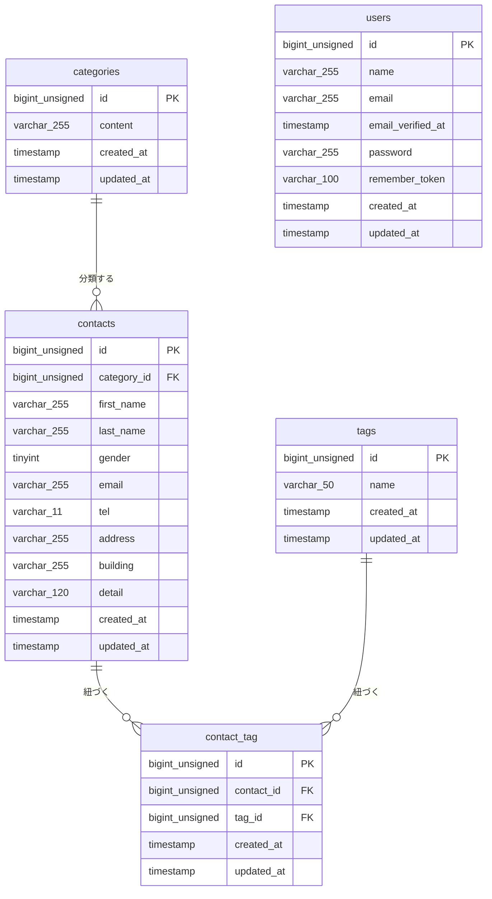

# ER図

```mermaid
erDiagram
    categories ||--o{ contacts : "分類する"
    contacts ||--o{ contact_tag : "紐づく"
    tags ||--o{ contact_tag : "紐づく"

    users {
        bigint_unsigned id PK
        varchar_255 name
        varchar_255 email
        timestamp email_verified_at
        varchar_255 password
        varchar_100 remember_token
        timestamp created_at
        timestamp updated_at
    }

    categories {
        bigint_unsigned id PK
        varchar_255 content
        timestamp created_at
        timestamp updated_at
    }

    contacts {
        bigint_unsigned id PK
        bigint_unsigned category_id FK
        varchar_255 first_name
        varchar_255 last_name
        tinyint gender
        varchar_255 email
        varchar_11 tel
        varchar_255 address
        varchar_255 building
        varchar_120 detail
        timestamp created_at
        timestamp updated_at
    }

    tags {
        bigint_unsigned id PK
        varchar_50 name
        timestamp created_at
        timestamp updated_at
    }

    contact_tag {
        bigint_unsigned id PK
        bigint_unsigned contact_id FK
        bigint_unsigned tag_id FK
        timestamp created_at
        timestamp updated_at
    }
```
